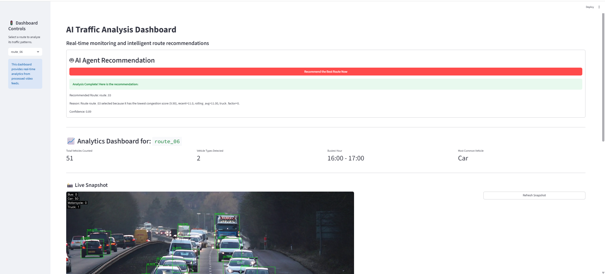
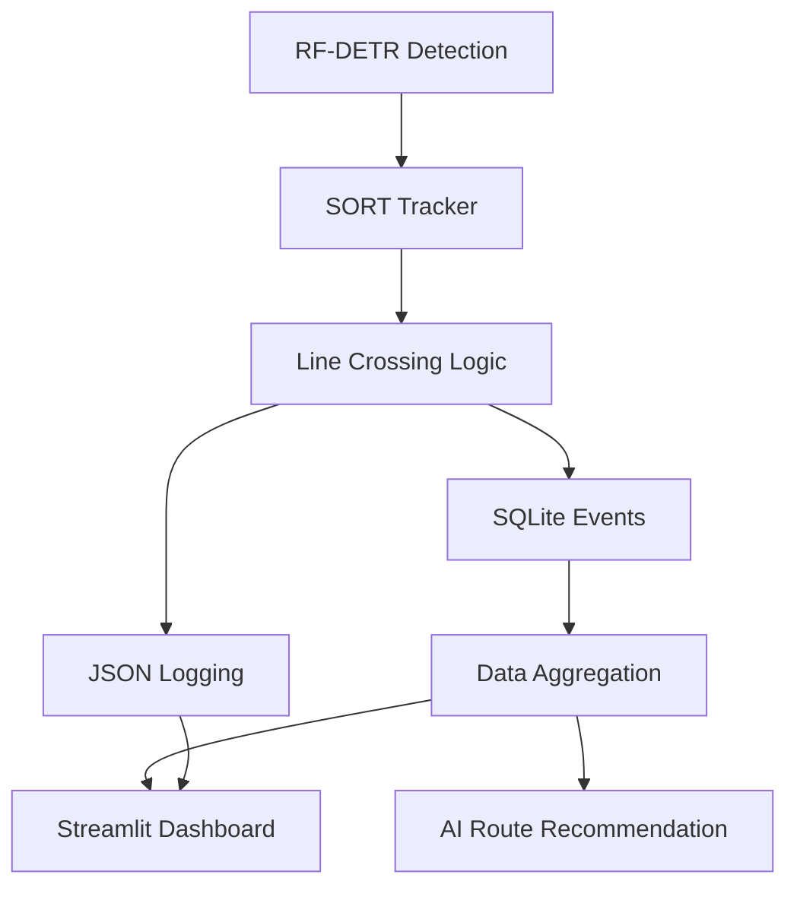
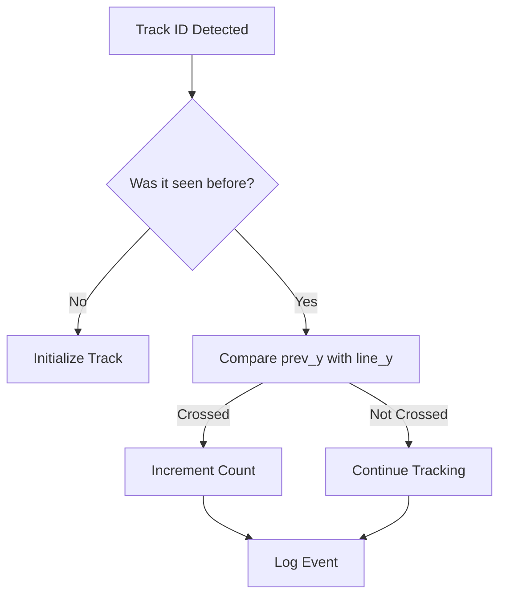
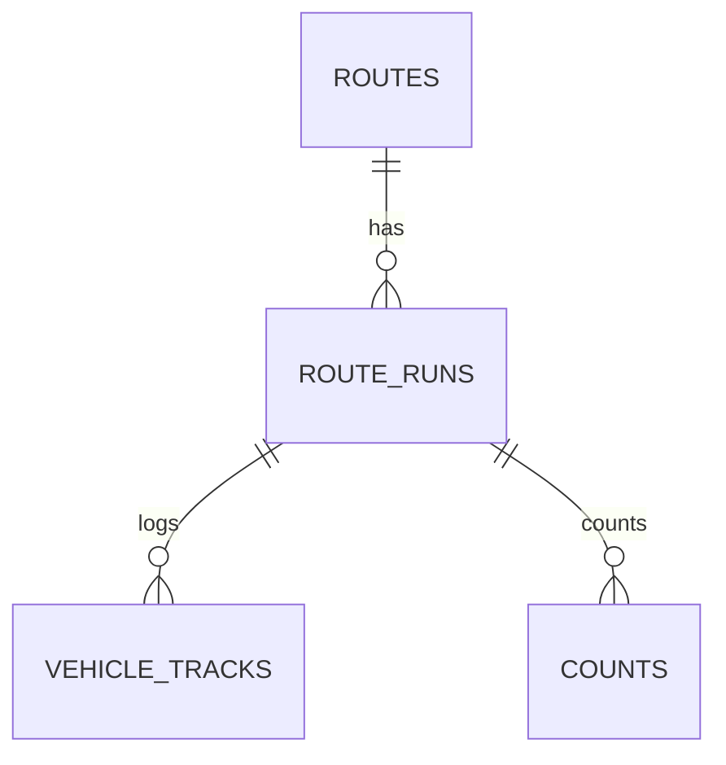

# 🚦 Real-Time Multi-Route Vehicle Counting & AI Route Recommendation

A complete end-to-end **AI/ML + Computer Vision + Agentic AI** project featuring:

* **RF-DETR Object Detection**
* **SORT Tracking**
* **Line Crossing Logic** for unique vehicle counting
* **SQLite + SQLAlchemy ORM** structured logging
* **JSON frame-level annotations**
* **Advanced data aggregation** (per-second, per-minute, hourly)
* **AI Agent (LangGraph + Tools)** for live route recommendations
* **Streamlit Analytics Dashboard** with charts, KPIs, and live snapshots

This project simulates a real-world traffic monitoring system across **6 independent routes**.

---

# 📸 Project Overview

This system processes multiple road surveillance videos simultaneously, detects and tracks moving vehicles, counts line crossings, logs events to a database, analyzes traffic congestion patterns, and recommends the optimal route using an AI agent.


*(Sample live snapshot as seen in the dashboard)*

---

# 🧱 System Architecture



---

# 🗂 Folder Structure

```
Final_Evaluation/
│── agent.py                # AI Agent + LangGraph workflow
│── DB.py                   # ORM models + analytics functions
│── routes.py               # Full detection + tracking pipeline
│── frontend.py             # Streamlit dashboard
│── config.yaml             # All settings in one place
│── processed_frames/       # Auto-generated snapshots
│── logs/                   # JSON logs per route
│── data/                   # Videos + database
│── requirements.txt
```

---

# 🚀 Features

### 🎥 **1. Real-Time Vehicle Detection & Tracking**

* RF-DETR model
* SORT tracker for consistent IDs
* Automatic scaling for different video sizes
* Detection interval optimization

### 📏 **2. Unique Vehicle Counting (Line Crossing)**

* Horizontal line per route
* Prevents re-counting using track history
* Class-wise counters (car, truck, bus, etc.)

### 📦 **3. JSON + SQLite Logging**

* JSON file per route
* SQL tables:

  * `routes`
  * `route_runs`
  * `vehicle_tracks`
  * `counts`

### 📊 **4. Analytics Engine**

* Per-second, per-minute, hourly summaries
* Traffic trends
* Rolling averages
* Class distributions

### 🤖 **5. Agentic AI Recommendation**

Uses:

* LangGraph
* LangChain Tools
* Scoring formula
* Confidence estimator

### 🧭 **6. Streamlit Dashboard**

* Route KPIs
* Peak hour detection
* Live snapshots
* Rolling charts
* Vehicle distribution
* AI route recommendation button

---

# 🛠 Installation

### 1️⃣ Clone the repository

```bash
git clone https://github.com/YOUR_USERNAME/Final_Evaluation.git
cd Final_Evaluation
```

### 2️⃣ Create environment

```bash
pip install -r requirements.txt
```

### 3️⃣ Configure

Edit values in `config.yaml` (paths, detection settings, agent settings).

---

# ▶️ How to Run

### **1. Process All Routes (Detection + Tracking + Counting)**

```bash
python routes.py
```

This generates:

* Processed frames
* Logs
* Database entries

---

### **2. Launch Dashboard**

```bash
streamlit run frontend.py
```

Dashboard provides:

* Traffic flow charts
* Class distribution
* Busiest hour
* Real-time AI recommendation

---

### **3. Get AI Recommendation from CLI**

```bash
python agent.py
```

Output example:

```
Recommended Route: route_04
Reason:
Route 04 shows lowest congestion score.
Confidence: 0.92
```

---

# 📈 Dashboard Preview


---

# 🔍 Line Crossing Logic Diagram



---

# 📦 Database Schema (ORM)



---

# ⚙ Configuration via config.yaml

Simplified sample:

```yaml
video_processing:
  detection:
    confidence_threshold: 0.80
    inference_size: [640, 640]
    target_classes: [car, truck, bus]
```

---

# 🧪 Testing

After processing routes, verify:

* DB tables populated
* JSON log exists
* Dashboard loads without error
* AI agent outputs valid recommendation

---

# 🙌 Credits

* **RF-DETR Model**
* **SORT Tracker**
* **LangChain / LangGraph**
* **Streamlit**

---

# ⭐ If this project helped you

Give the repo a **Star ⭐** on GitHub!
